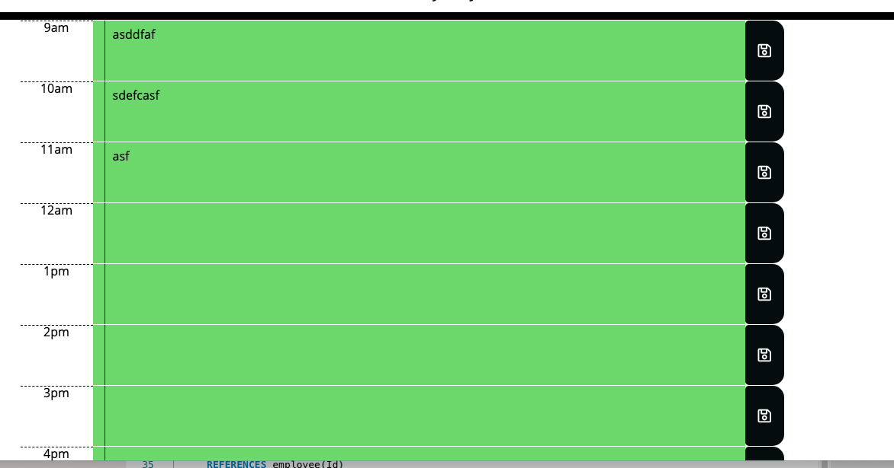

# Employee Tracker

## Table of Contents

- [License](#license)
- [Description](#description)
- [Usage](#instructions)
- [Questions](#questions)

## License

## Description

This daily planner saves daily activity and turns different highlighted colors based on past, current and future notes.

## Usage

Use day planner to fill out a 9 - 5 day schedule. Click save to add new notes to the schedule.

## Questions

Send questions to:  
Github: [Jenya Seletsky](https://github.com/Jenya10016)  
Email: js646@me.com  
